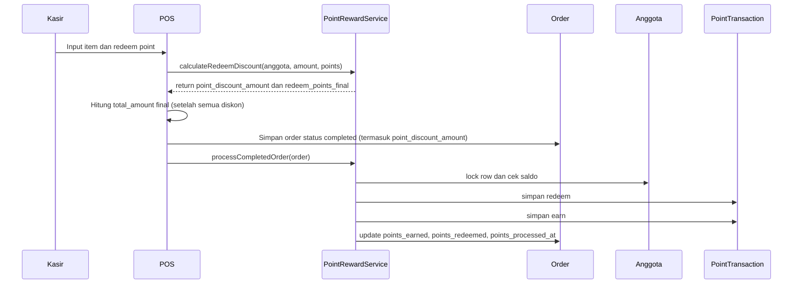
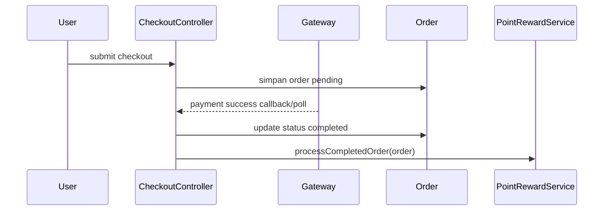
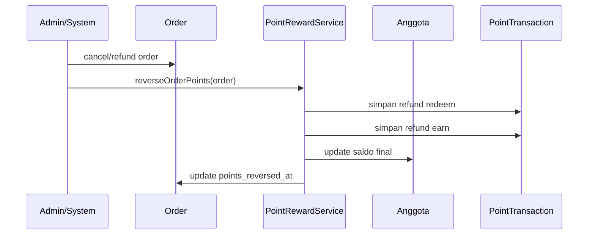

# Konsep Fitur Point Reward - Kospin POS

## 1. Ringkasan

Fitur `Point Reward` adalah sistem loyalitas anggota yang memungkinkan member:

- mendapatkan poin dari transaksi yang valid,
- menukarkan poin menjadi potongan belanja,
- melihat saldo dan riwayat mutasi poin,
- dicetak kartunya untuk identifikasi di kasir.

Fitur ini harus terintegrasi ke dua jalur transaksi yang sudah ada:

- POS kasir via `app/Livewire/Pos.php`
- Checkout publik via `app/Http/Controllers/CheckoutController.php`

Implementasi harus menjaga:

- konsistensi saldo poin,
- idempotency agar poin tidak dobel,
- pemisahan diskon voucher/admin discount vs diskon poin,
- audit trail yang jelas.

---

## 2. Kondisi Codebase Saat Ini

Berikut fakta yang sudah ada di project dan harus jadi dasar desain:

1. Tabel `settings` saat ini bukan key-value store, tetapi single-row table dengan kolom tetap seperti `shop`, `address`, `phone`, `name_printer`, `image`, dan `print_via_mobile`.
2. Model `Anggota` saat ini hanya memiliki `nama_lengkap`, `nik`, dan `total_pembelian`.
3. `CheckoutController::checkMember()` sudah memakai field `no_hp` dan `alamat`, tetapi kedua field tersebut belum ada di migration awal `anggotas`.
4. POS membuat order dengan status `completed`, tetapi checkout publik membuat order dengan status `pending`.
5. Mapping status gateway di checkout online saat ini mengubah status sukses ke `processing`, bukan `completed`.
6. POS saat ini sudah memiliki field diskon persen `discount` yang berbeda konsep dengan voucher dan nantinya harus dibedakan juga dari diskon poin.

Implikasi:

- dokumen ini tidak boleh mengasumsikan struktur settings berbasis `key => value`,
- reward point harus punya trigger yang jelas per channel transaksi,
- perlu mekanisme idempotent agar perubahan status order tidak memicu mutasi poin berulang.

---

## 3. Tujuan Fitur

### 3.1 Saldo Poin

- Setiap anggota memiliki `poin_saldo`.
- Saldo aktif ditampilkan di admin, checkout member, halaman cek poin, dan struk.
- Semua perubahan saldo wajib memiliki riwayat mutasi.

### 3.2 Earn Point

- Poin didapat dari nilai transaksi yang valid.
- Formula default: `Rp 1.000 = 1 poin`.
- Perhitungan dibulatkan ke bawah dengan `floor`.
- Basis perhitungan poin adalah nilai setelah seluruh diskon diterapkan.

Contoh:

```text
Subtotal             : Rp 150.000
Diskon voucher/admin : Rp 10.000
Diskon poin          : Rp 20.000
Dasar earn point     : Rp 120.000
Conversion rate      : Rp 1.000 / 1 poin
Poin didapat         : floor(120.000 / 1.000) = 120 poin
```

### 3.3 Redeem Point

- Anggota dapat menukar poin menjadi potongan harga saat checkout.
- Formula default: `1 poin = Rp 100`.
- Redeem harus mematuhi minimum poin dan maksimum persentase diskon.
- Diskon poin harus tercatat terpisah dari diskon voucher dan diskon persen POS.

Contoh:

```text
Subtotal              : Rp 100.000
Saldo poin awal       : 500
Poin diredeem         : 200
Nilai redeem          : 200 x Rp 100 = Rp 20.000
Total bayar           : Rp 80.000
Poin tersisa          : 300
Poin earned baru      : floor(80.000 / 1.000) = 80
Saldo akhir           : 380
```

### 3.4 Audit dan Transparansi

- Semua mutasi poin harus masuk ke tabel histori.
- Sistem harus bisa membedakan mutasi `earn`, `redeem`, `refund`, `adjustment`, dan `expired`.
- Setiap mutasi harus bisa ditelusuri ke order atau admin action penyebabnya.

---

## 4. Status Order dan Trigger Poin

Bagian ini wajib dijadikan patokan implementasi, karena saat ini flow POS dan checkout online berbeda.

### 4.1 POS Kasir

- Order dari POS saat ini langsung dibuat dengan status `completed`.
- Karena itu, POS boleh langsung menjalankan redeem dan earn dalam satu database transaction saat `checkout()`.

### 4.2 Checkout Publik / Online

- Order online saat ini dibuat sebagai `pending`.
- Setelah pembayaran sukses, status order harus dipindahkan ke status final yang dianggap eligible untuk reward point.

### 4.3 Keputusan Desain yang Disarankan

Gunakan aturan berikut:

1. Poin hanya diproses saat order mencapai status final sukses.
2. Status final sukses untuk reward point harus disepakati satu saja:
   - opsi A: tetap gunakan `completed`, atau
   - opsi B: gunakan `processing` sebagai status sukses operasional.
3. Dokumen implementasi dan kode harus konsisten. Jangan satu file memakai `completed`, sementara checkout online berhenti di `processing`.

Rekomendasi untuk project ini:

- gunakan `completed` sebagai status final sukses untuk reward point,
- setelah gateway settlement/capture berhasil, update order ke `completed`,
- jangan hitung poin di `thankYou()` secara langsung kecuali lewat service idempotent.

### 4.4 Idempotency Wajib

Karena status order bisa berubah lebih dari sekali, pemrosesan poin harus idempotent.

Tambahkan salah satu atau kombinasi berikut:

- kolom `points_processed_at` nullable di tabel `orders`,
- kolom `points_reversed_at` nullable di tabel `orders`,
- unique index pada histori berdasarkan kombinasi relevan,
- service `PointRewardService::processOrder()` yang cek kondisi sebelum mutasi.

Aturan:

- `earn` untuk satu order hanya boleh terjadi satu kali,
- `redeem` untuk satu order hanya boleh terjadi satu kali,
- `refund/reversal` untuk satu order hanya boleh terjadi satu kali per skenario.

---

## 5. Struktur Data yang Diperlukan

### 5.1 Tabel `anggotas`

Tambahkan kolom:

```php
$table->unsignedInteger('poin_saldo')->default(0);
$table->string('no_hp')->nullable()->index();
$table->text('alamat')->nullable();
$table->unsignedInteger('lifetime_points')->default(0);
```

Catatan:

- `no_hp` diperlukan karena sudah dipakai di `CheckoutController::checkMember()`.
- `lifetime_points` belum wajib untuk fase awal, tetapi sebaiknya disiapkan jika nanti ingin tier membership.
- `nik` sebaiknya diberi unique index bila belum ada. Migration awal belum menambahkan constraint unique. Sebelum menambah unique index, verifikasi data existing untuk memastikan tidak ada duplikat NIK.

### 5.2 Tabel `orders`

Tambahkan kolom:

```php
$table->unsignedInteger('points_earned')->default(0);
$table->unsignedInteger('points_redeemed')->default(0);
$table->decimal('point_discount_amount', 12, 2)->default(0);
$table->timestamp('points_processed_at')->nullable();
$table->timestamp('points_reversed_at')->nullable();
```

Makna kolom:

- `points_earned`: poin yang didapat dari order ini
- `points_redeemed`: poin yang dipakai di order ini
- `point_discount_amount`: nilai rupiah hasil redeem
- `points_processed_at`: penanda earn/redeem order sudah dijalankan
- `points_reversed_at`: penanda reversal akibat cancel/refund sudah dijalankan

### 5.3 Tabel `point_transactions`

```php
Schema::create('point_transactions', function (Blueprint $table) {
    $table->id();
    $table->foreignId('anggota_id')->constrained('anggotas')->cascadeOnDelete();
    $table->foreignUuid('order_id')->nullable()->constrained('orders')->nullOnDelete();
    $table->enum('type', ['earn', 'redeem', 'refund', 'adjustment', 'expired']);
    $table->integer('points');
    $table->integer('balance_after');
    $table->string('description')->nullable();
    $table->foreignId('created_by')->nullable()->constrained('users')->nullOnDelete();
    $table->json('meta')->nullable();
    $table->timestamps();

    $table->index(['anggota_id', 'created_at']);
    $table->index(['order_id', 'type']);
});
```

Catatan penting:

- `order_id` harus mengikuti tipe primary key `orders` yang sekarang berupa UUID string. Karena itu jangan gunakan `foreignId('order_id')`.
- `points` boleh positif atau negatif.
- `balance_after` sengaja menggunakan `integer` (bukan `unsignedInteger`) sebagai safety net jika ada edge case adjustment admin yang membuat saldo minus sementara.
- `meta` dipakai untuk menyimpan snapshot aturan saat transaksi diproses, misalnya `conversion_rate`, `redemption_value`, sumber proses, atau nilai dasar perhitungan.

### 5.4 Konfigurasi Point Reward di `settings`

Karena tabel `settings` sekarang berbasis kolom tetap, tambahkan kolom baru langsung ke tabel `settings`:

```php
$table->boolean('point_feature_enabled')->default(true);
$table->unsignedInteger('point_conversion_rate')->default(1000);
$table->unsignedInteger('point_redemption_value')->default(100);
$table->unsignedInteger('point_minimum_redeem')->default(10);
$table->unsignedTinyInteger('point_max_discount_percentage')->default(50);
$table->unsignedInteger('point_expiry_months')->default(0);
```

Jangan gunakan desain `settings` berbasis `key` untuk fitur ini kecuali seluruh arsitektur settings memang diubah.

---

## 6. Aturan Bisnis

### 6.1 Rumus Redeem

```text
max_redeem_amount = total_sebelum_point_discount x point_max_discount_percentage / 100
max_redeem_points = floor(max_redeem_amount / point_redemption_value)
redeem_points_final = min(requested_points, saldo_poin, max_redeem_points)
point_discount_amount = redeem_points_final x point_redemption_value
```

### 6.2 Urutan Perhitungan Diskon

Urutan final yang disarankan:

1. hitung subtotal item,
2. terapkan diskon admin / diskon persen POS,
3. terapkan voucher,
4. hitung maksimum redeem poin,
5. terapkan diskon poin,
6. hasil akhirnya menjadi `total_amount`,
7. earn point dihitung dari `total_amount` setelah semua diskon.

Dokumen implementasi tidak boleh lagi ambigu soal apakah voucher dihitung sebelum atau sesudah redeem.

### 6.3 Validasi Redeem

Redeem hanya boleh jika:

- fitur poin aktif,
- order memiliki `anggota_id`,
- saldo poin anggota mencukupi,
- poin yang diminta memenuhi minimum redeem,
- nilai redeem tidak melebihi batas persen diskon,
- total bayar tidak menjadi negatif.

### 6.4 Reversal

Jika order yang sudah diproses poinnya kemudian dibatalkan atau direfund:

- poin `earn` dari order tersebut harus dikurangi kembali,
- poin `redeem` dari order tersebut harus dikembalikan ke anggota,
- reversal hanya boleh dijalankan sekali.

Jika project belum punya refund parsial yang jelas, fase awal cukup dukung reversal penuh per order.

---

## 7. Kebutuhan Model dan Service

### 7.1 `app/Models/Anggota.php`

Perlu ditambah:

- `fillable`: `no_hp`, `alamat`, `poin_saldo`, `lifetime_points`
- cast integer untuk field poin
- relasi `pointTransactions()`
- helper domain seperlunya, tetapi jangan menaruh seluruh business logic kompleks di model

### 7.2 `app/Models/Order.php`

Perlu ditambah:

- `fillable`: `points_earned`, `points_redeemed`, `point_discount_amount`, `points_processed_at`, `points_reversed_at`
- cast untuk decimal dan timestamp field baru
- helper seperti `hasProcessedPoints()`

### 7.3 `app/Models/PointTransaction.php`

Model baru untuk histori mutasi poin.

### 7.4 Service Baru

Disarankan menambah service:

- `app/Services/PointRewardService.php`

Minimal method:

- `calculateEarnedPoints(decimal $amount): int`
- `calculateRedeemDiscount(Anggota $anggota, decimal $amount, int $requestedPoints): array`
- `processCompletedOrder(Order $order): void`
- `reverseOrderPoints(Order $order, string $reason = null): void`
- `adjustMemberPoints(Anggota $anggota, int $points, string $description, ?int $userId = null): void`

Alasan:

- logic poin akan dipakai oleh POS, checkout online, admin adjustment, dan potensi webhook/refund,
- tanpa service, logic mudah terduplikasi di `Pos.php` dan `CheckoutController.php`.

---

## 8. File yang Perlu Diubah atau Ditambah

### 8.1 Models

| File | Aksi | Detail |
|---|---|---|
| `app/Models/Anggota.php` | MODIFY | Tambah field poin, no HP, alamat, relasi histori |
| `app/Models/Order.php` | MODIFY | Tambah field poin dan helper status pemrosesan |
| `app/Models/PointTransaction.php` | NEW | Model histori mutasi poin |
| `app/Models/Setting.php` | MODIFY | Tambah field konfigurasi point reward ke `fillable` dan cast |

### 8.2 Service

| File | Aksi | Detail |
|---|---|---|
| `app/Services/PointRewardService.php` | NEW | Sumber utama semua logic earn, redeem, reversal, dan adjustment |

### 8.3 Controllers

| File | Aksi | Detail |
|---|---|---|
| `app/Http/Controllers/CheckoutController.php` | MODIFY | Tambah display saldo/member point, simpan redeem request, proses poin via service |
| `app/Http/Controllers/MemberPointController.php` | NEW | Halaman cek poin publik |
| `app/Http/Controllers/MemberCardController.php` | NEW | Cetak kartu member PDF |

### 8.4 Livewire

| File | Aksi | Detail |
|---|---|---|
| `app/Livewire/Pos.php` | MODIFY | Input redeem poin, hitung total final, panggil service point reward saat checkout |

### 8.5 Filament

| File | Aksi | Detail |
|---|---|---|
| `app/Filament/Resources/AnggotaResource.php` | MODIFY | Tambah form `no_hp`, `alamat`, `poin_saldo`, action adjustment poin, tombol cetak kartu |
| `app/Filament/Resources/PointTransactionResource.php` | NEW | Riwayat mutasi poin, idealnya read-only |
| `app/Filament/Resources/SettingResource.php` | MODIFY | Tambah field konfigurasi point reward di resource settings yang sudah ada |

Catatan:

- tidak perlu membuat `PointRewardSettings` page baru jika `SettingResource` existing sudah cukup dipakai.
- lebih baik manfaatkan resource settings yang sudah ada agar konfigurasi tetap terpusat.

### 8.6 Views

| File | Aksi | Detail |
|---|---|---|
| `resources/views/member/points.blade.php` | NEW | Halaman cek poin publik |
| `resources/views/member/card-pdf.blade.php` | NEW | Template PDF kartu member |
| `resources/views/livewire/pos.blade.php` | MODIFY | UI redeem point di POS |
| `resources/views/checkout.blade.php` | MODIFY | UI saldo poin dan input redeem di checkout publik |
| `resources/views/thank-you.blade.php` | MODIFY | Tampilkan info poin earned/redeemed/saldo terbaru |
| `resources/views/pdf/order.blade.php` atau view struk terkait | MODIFY | Tambahkan info poin di PDF invoice/struk |

### 8.7 Routes

Tambahan minimal:

```php
Route::get('/member/points', [MemberPointController::class, 'index'])
    ->name('member.points');

Route::post('/member/check-points', [MemberPointController::class, 'checkPoints'])
    ->middleware('throttle:5,1')
    ->name('member.check-points');
```

Catatan:

- lebih aman gunakan `POST` untuk pengecekan publik dibanding `GET` dengan identifier di URL,
- jika halaman menggunakan Blade form, pastikan pakai `@csrf`. Jika endpoint dikonsumsi sebagai API stateless, tambahkan route ke `$except` di `VerifyCsrfToken` middleware,
- response harus mem-mask data sensitif.

### 8.8 Migrations

| File | Detail |
|---|---|
| `xxxx_xx_xx_add_point_fields_to_anggotas_table.php` | Tambah `poin_saldo`, `no_hp`, `alamat`, `lifetime_points` |
| `xxxx_xx_xx_create_point_transactions_table.php` | Histori mutasi poin |
| `xxxx_xx_xx_add_point_fields_to_orders_table.php` | Tambah field poin, processed marker, reversed marker |
| `xxxx_xx_xx_add_point_settings_to_settings_table.php` | Tambah kolom konfigurasi point reward ke tabel `settings` |

---

## 9. Flow Implementasi

### 9.1 Earn + Redeem di POS

Penting: nilai `point_discount_amount` harus sudah dihitung **sebelum** order disimpan karena mempengaruhi `total_amount`. Maka service memisahkan **kalkulasi** (sebelum save) dan **mutasi saldo** (setelah save).



### 9.2 Earn + Redeem di Checkout Online



### 9.3 Reversal



---

## 10. Keamanan dan Konsistensi

### 10.1 Public Point Check

Halaman cek poin publik berisiko membuka data anggota.

Minimal proteksi:

- rate limit,
- input sanitization,
- masking nama dan nomor HP,
- jangan tampilkan alamat lengkap,
- audit log request mencurigakan.

Rekomendasi lebih aman:

- verifikasi OTP ke nomor HP anggota sebelum menampilkan saldo detail.

### 10.2 Race Condition

Saat redeem point, gunakan database transaction dan row locking:

- lock row `anggotas` dengan `SELECT ... FOR UPDATE`,
- baca saldo terbaru di dalam transaction,
- validasi ulang requested redeem,
- baru update saldo dan insert histori.

Tanpa ini, anggota bisa double-spend dari dua kasir atau checkout bersamaan.

### 10.3 Source of Truth

Source of truth saldo aktif tetap ada di `anggotas.poin_saldo`, tetapi histori di `point_transactions` wajib lengkap agar saldo bisa diaudit.

---

## 11. Fitur Tambahan yang Layak, Tapi Bukan Prioritas Awal

### 11.1 Expiry Point

- setting `point_expiry_months`
- command `php artisan points:expire`
- idealnya memerlukan basis poin per batch/perolehan, bukan hanya saldo global
- desain `point_transactions` saat ini belum cukup untuk expiry akurat per batch hanya dengan mengandalkan `created_at`
- jika expiry diaktifkan nanti, perlu mekanisme alokasi konsumsi poin per batch earn, misalnya pendekatan FIFO ledger atau tabel bucket khusus

### 11.2 Membership Tier

- Bronze / Silver / Gold
- berdasarkan `lifetime_points`
- tiap tier bisa punya multiplier earn yang berbeda

### 11.3 Laporan dan Dashboard

- export histori poin per anggota/periode
- widget total outstanding point liability
- ringkasan poin earned vs redeemed

### 11.4 Notifikasi Struk

Tambahkan ke thermal print dan PDF:

- `Poin Didapat: +XX`
- `Poin Dipakai: -XX`
- `Saldo Poin: XXX`

---

## 12. Prioritas Implementasi

| Fase | Scope | Estimasi |
|---|---|---|
| 1 | Migration `anggotas`, `orders`, `point_transactions`, `settings` | 1-2 jam |
| 2 | Model update + `PointRewardService` | 2-3 jam |
| 3 | Integrasi POS `Pos.php` + view redeem | 2-3 jam |
| 4 | Integrasi checkout publik + final status handling | 2-4 jam |
| 5 | Filament `AnggotaResource`, `SettingResource`, `PointTransactionResource` | 2-3 jam |
| 6 | Halaman cek poin publik | 1-2 jam |
| 7 | Cetak kartu member + update struk/PDF | 1-2 jam |
| 8 | Reversal, expiry, laporan tambahan | opsional |

---

## 13. Checklist Implementasi

- Tambah field anggota: `no_hp`, `alamat`, `poin_saldo`, `lifetime_points`
- Tambah unique index pada `nik` (setelah verifikasi data existing)
- Tambah field order terkait poin
- Tambah field setting point reward ke tabel `settings`
- Buat model `PointTransaction`
- Buat service `PointRewardService`
- Integrasikan POS dengan redeem dan earn point
- Integrasikan checkout online dengan status sukses final dan pemrosesan poin
- Update `AnggotaResource` Filament (form, infolist, action adjustment poin, tombol cetak kartu)
- Buat `PointTransactionResource` Filament (read-only)
- Update `SettingResource` dengan field konfigurasi point reward
- Tambah action adjustment manual di admin
- Tambah halaman cek poin publik
- Cetak kartu member PDF
- Tambah output poin di struk thermal, thank you page, dan PDF
- Tambah test idempotency dan concurrency

---

## 14. Testing yang Wajib

Minimal test coverage:

1. Perhitungan earned point dari total setelah semua diskon.
2. Validasi minimum redeem.
3. Validasi maksimum redeem berdasarkan persentase.
4. Redeem gagal jika saldo tidak cukup.
5. Earn + redeem dalam satu order POS.
6. Order online sukses memproses poin tepat satu kali.
7. Reversal mengembalikan dan mengurangi poin dengan benar.
8. Concurrent redeem tidak menyebabkan saldo minus.
9. Public point check tidak menampilkan data sensitif berlebihan.

---

## 15. Keputusan Teknis Final

Supaya implementasi tidak melebar, fase awal disarankan memakai batasan berikut:

1. Hanya support full reversal, belum partial refund.
2. Setting poin ditambah sebagai kolom baru di tabel `settings`, bukan key-value store.
3. Reward point hanya untuk order dengan `anggota_id`.
4. Trigger pemrosesan poin memakai status final sukses yang konsisten, direkomendasikan `completed`.
5. Semua logic utama dipusatkan di `PointRewardService`.

Dengan batasan ini, fitur bisa diimplementasikan tanpa mengubah arsitektur project secara berlebihan dan tetap aman untuk transaksi nyata.
